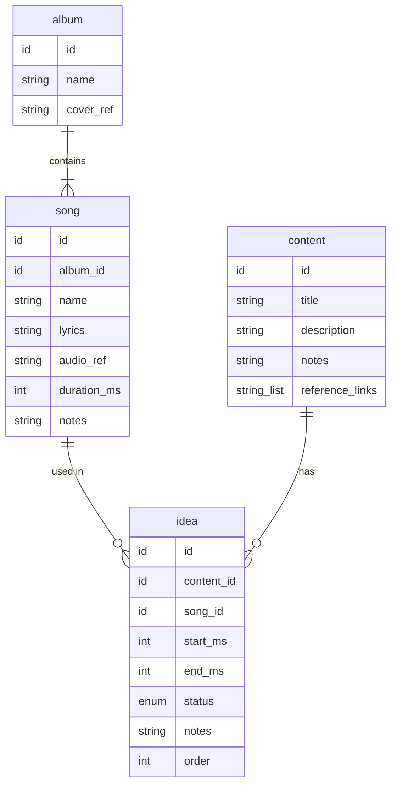

# Modelo de Domínio — Plataforma de Organização de Conteúdo Musical

## Visão Geral

A plataforma existe para **reduzir o atrito entre ter uma ideia e gravar um conteúdo musical**, eliminando o tempo gasto decidindo *o que gravar* e deixando o momento de execução focado apenas em produzir o conteúdo.

Este documento descreve o modelo de domínio decidido em conjunto durante a fase de análise. Ele reflete apenas o que foi definido na conversa e o que está descrito em [Idea.md](Idea.md). Convenções: nomes de entidades, tabelas e campos em **inglês**, em **`snake_case`**.

---

## Entidades

### 1. `album`

**Responsabilidade:** Agrupar uma ou mais músicas sob uma mesma capa. Um "single" é apenas um álbum contendo uma única música (padrão inspirado no Spotify: internamente tudo é álbum, a UI decide se apresenta como álbum ou single).

**Atributos principais:**

| Campo       | Tipo   | Obrigatório | Descrição                                    |
|-------------|--------|-------------|----------------------------------------------|
| `id`        | id     | Sim         | Identificador único.                         |
| `name`      | string | Sim         | Nome do álbum.                               |
| `cover_ref` | string | Não         | Referência (URL/caminho) para a imagem da capa. |

**Relacionamentos:**
- `album` **1 — N** `song` — um álbum contém uma ou mais músicas.

---

### 2. `song`

**Responsabilidade:** Representar uma música na biblioteca, com seus metadados e áudio. É a unidade reproduzível da plataforma.

**Atributos principais:**

| Campo         | Tipo   | Obrigatório | Descrição                                                                                     |
|---------------|--------|-------------|-----------------------------------------------------------------------------------------------|
| `id`          | id     | Sim         | Identificador único.                                                                          |
| `album_id`    | id     | Sim         | Álbum ao qual a música pertence.                                                              |
| `name`        | string | Sim         | Nome da música.                                                                               |
| `lyrics`      | string | Não         | Letra da música.                                                                              |
| `audio_ref`   | string | Não         | Referência (URL/caminho) para o arquivo de áudio, servido pela própria plataforma.            |
| `duration_ms` | int    | Não         | Duração total do áudio em milissegundos. Útil para validar os limites do trecho selecionado.  |
| `notes`       | string | Não         | Observações livres sobre a música.                                                            |

**Relacionamentos:**
- `song` **N — 1** `album` — toda música pertence a exatamente um álbum.
- `song` **1 — N** `idea` — uma música pode ser usada em várias ideias.

---

### 3. `content`

**Responsabilidade:** Representar uma ideia de divulgação (uma publicação a ser gravada). Centraliza a referência, descrição, notas e links associados à ideia.

**Atributos principais:**

| Campo             | Tipo         | Obrigatório | Descrição                                                                       |
|-------------------|--------------|-------------|---------------------------------------------------------------------------------|
| `id`              | id           | Sim         | Identificador único.                                                            |
| `title`           | string       | Sim         | Título do conteúdo.                                                             |
| `description`     | string       | Não         | Descrição da ideia.                                                             |
| `notes`           | string       | Não         | Notas livres sobre o conteúdo.                                                  |
| `reference_links` | string_list  | Não         | Zero ou mais links de referência (Instagram, TikTok, etc.).                     |

**Relacionamentos:**
- `content` **1 — N** `idea` — um conteúdo pode ter zero ou várias ideias associadas.

---

### 4. `idea`

**Responsabilidade:** Entidade de associação entre `content` e `song`. Representa uma **ideia de gravação** — a combinação de um conteúdo com uma música específica, com seu trecho, status e posição na fila. Não é uma tabela de junção pura: ela carrega dados próprios da combinação (o trecho selecionado, o status de publicação, notas específicas daquela ideia e a posição na fila).

**Atributos principais:**

| Campo        | Tipo   | Obrigatório | Descrição                                                                                                    |
|--------------|--------|-------------|--------------------------------------------------------------------------------------------------------------|
| `id`         | id     | Sim         | Identificador único.                                                                                         |
| `content_id` | id     | Sim         | Conteúdo ao qual essa ideia pertence.                                                                        |
| `song_id`    | id     | Sim         | Música associada à ideia.                                                                                    |
| `start_ms`   | int    | Não         | Início do trecho, em milissegundos. Quando ausente, o player toca a música inteira.                          |
| `end_ms`     | int    | Não         | Fim do trecho, em milissegundos. Quando ausente, o player toca a música inteira.                             |
| `status`     | enum   | Sim         | `UNPUBLISHED` \| `PUBLISHED`. O status é por ideia, não por conteúdo.                                        |
| `notes`      | string | Não         | Notas específicas dessa ideia (separadas das notas do conteúdo e das observações da música).                 |
| `order`      | int    | Sim         | Posição na fila global da Tela Principal.                                                                    |

**Relacionamentos:**
- `idea` **N — 1** `content`.
- `idea` **N — 1** `song`.

---

## Relacionamentos (resumo)

| Relacionamento                                    | Cardinalidade |
|---------------------------------------------------|---------------|
| `album` contém `song`                             | 1 — N         |
| `content` possui `idea`                           | 1 — N         |
| `song` é usada em `idea`                          | 1 — N         |
| `content` ⇄ `song` (efetivo, através de `idea`)   | N — N         |

---

## Regras de Domínio

### Fila / Ordenação
- **Ordem global de `idea`**: a fila da Tela Principal ("o que vou gravar agora?") é uma lista ordenada de `idea`, **não** de `content`. O drag-and-drop reordena `idea`.
- A metáfora visual pode ser um "calendário" (uma `idea` por posição), mas **não há semântica real de datas** no MVP.
- Um `content` que ainda não possui nenhuma `idea` **não aparece** na Tela Principal.

### Status e Progresso
- O `status` é uma propriedade de cada `idea`, não do `content` como um todo.
- O contador de progresso conta `idea`:
  - **Total** = número de `idea`.
  - **Publicados** = `idea` com `status = PUBLISHED`.
  - **Restantes** = `idea` com `status = UNPUBLISHED`.

### Duplicação de Conteúdo
- Duplicar um `content` copia: `title`, `description`, `reference_links`, `notes`.
- Duplicar **não copia** as `idea` do original — o novo conteúdo começa sem ideias associadas.

### Opcionalidades
- **Áudio opcional**: uma `song` pode ser cadastrada sem `audio_ref`. Enquanto não houver áudio, `idea` daquela música não conseguem reproduzir trecho.
- **Letra opcional**.
- **Trecho opcional**: uma `idea` pode existir sem `start_ms`/`end_ms`. Enquanto não houver trecho, o player toca a música inteira.

### Álbum
- Toda `song` pertence a exatamente **um** `album`.
- Um `album` pode ter uma ou mais `song` (single = álbum com uma música).
- A **capa** vive no `album`, não na `song`. Músicas do mesmo álbum compartilham automaticamente a capa.

### Exclusão em cascata
- Excluir `song` → remove todas as `idea` que apontam para ela.
- Excluir `content` → remove todas as `idea` daquele conteúdo. Músicas permanecem intactas.
- Excluir `idea` → livre, a qualquer momento (não bloqueia mesmo se estiver publicada).

---

## Diagrama (Mermaid ER)

---

## Observações para futuras implementações

Pontos que apareceram durante a análise mas cuja decisão foi deliberadamente adiada — listados aqui para não perder o contexto, **sem** tomar decisão agora:

- **Storage do áudio**: onde o arquivo apontado por `song.audio_ref` fica armazenado (S3, bucket, disco local, etc.) é decisão de implementação, não de domínio. O domínio apenas garante que a URL é servida pela própria plataforma para que o play aconteça no site sem redirecionamento externo.
- **Calendário com datas reais**: fora do MVP (conforme [Idea.md](Idea.md), item "Fora do MVP"). No MVP, a metáfora de calendário é apenas visual. Caso, no futuro, se decida por agendamento real por data, o local natural para um campo `scheduled_date` seria a `idea`.
- **UI da Tela Principal**: o formato exato do card e a navegação entre `idea` (lista, tabs, um por vez, etc.) não são decisões de domínio e ficam para a fase de design/UI.
- **Formato do `status`**: hoje é um enum binário (`UNPUBLISHED` / `PUBLISHED`). Se no futuro surgirem estados intermediários (ex.: `RECORDING`, `SCHEDULED`), a `idea` é o local certo para expandir.
