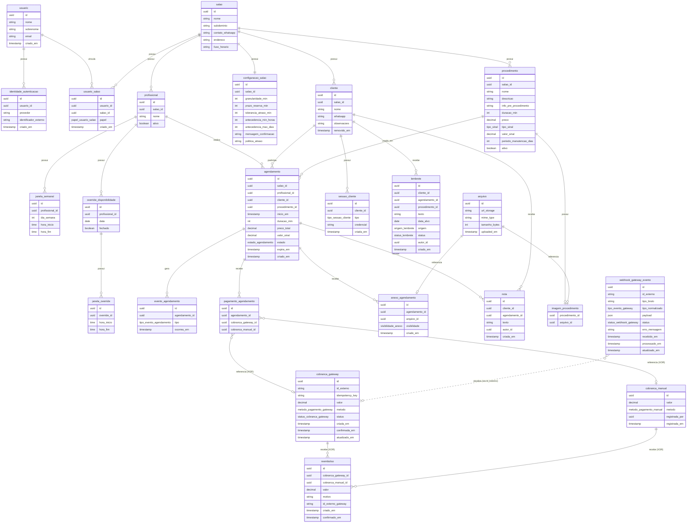

# Modelo de Domínio — Fluy

## Visão geral

O Fluy é um SaaS multi-tenant para salões de beleza. O domínio gira em torno de um único fluxo central: **um salão publica seus procedimentos e sua disponibilidade → uma cliente encontra o salão pelo subdomínio, se identifica sem conta, escolhe procedimento + horário, paga o sinal (ou o total) → o agendamento vive até ser concluído, cancelado ou marcado como no-show → o dinheiro que entra alimenta o faturamento**.

Este documento é a referência de **estrutura do domínio** — quais entidades existem, como se relacionam, quais atributos elas carregam e quais capacidades justificam a existência de cada uma. Ele **não repete regras de negócio** já descritas nas [features](../features/) e nos [fluxos](../fluxos/) — quando uma regra é importante para entender uma entidade, aponta-se para o documento canônico.

## Convenções

- **Banco:** PostgreSQL.
- **Idioma:** português.
- **Nomenclatura:** `snake_case`.
- **Chaves primárias:** UUID.
- **Chaves estrangeiras:** UUID.
- **Timestamps:** sufixo `_em` (ex.: `criado_em`, `confirmado_em`).
- **Valores monetários:** tipo numérico com precisão explícita. MVP atende apenas Brasil (BRL); campo de moeda será adicionado se surgir necessidade de outras moedas.
- **Enums:** cada enum tem nome próprio (padrão `<contexto>_<campo>`, ex.: `estado_agendamento`, `metodo_pagamento_manual`) e é definido em uma seção **"Enums"** ao final do arquivo do módulo onde é usado. Tabelas de atributos referenciam o enum pelo nome, não repetem os valores.
- **Multi-tenant:** todo dado pertence a um `salao` (direta ou indiretamente via FK). Entidades genéricas de infra (como `arquivo`) não carregam `salao_id`; o vínculo com o salão emerge das tabelas que se relacionam com elas.
- **Fuso horário:** armazenamento em UTC; interpretação sempre no fuso do salão.

## Módulos

O domínio está dividido em módulos por afinidade funcional. Cada arquivo detalha as entidades daquele módulo (responsabilidade, atributos, relacionamentos, features relacionadas).

- [salao.md](./salao.md) — `usuario`, `identidade_autenticacao`, `salao`, `usuario_salao`, `profissional`, `configuracao_salao`
- [disponibilidade.md](./disponibilidade.md) — `janela_semanal`, `override_disponibilidade`
- [procedimentos.md](./procedimentos.md) — `procedimento`
- [clientes.md](./clientes.md) — `cliente`, `sessao_cliente`
- [agendamento.md](./agendamento.md) — `agendamento`, `evento_agendamento`
- [pagamentos.md](./pagamentos.md) — `webhook_gateway_evento`, `cobranca_gateway`, `cobranca_manual`, `pagamento_agendamento`, `reembolso`
- [anexos.md](./anexos.md) — `arquivo`, `imagem_procedimento`, `anexo_agendamento`
- [notas-e-lembretes.md](./notas-e-lembretes.md) — `nota`, `lembrete`
- [faturamento.md](./faturamento.md) — observação: agregado calculado, sem entidade persistida

## Resumo dos relacionamentos

| Relacionamento | Cardinalidade |
|---|---|
| `usuario` possui `identidade_autenticacao` | 1 → N |
| `usuario` possui `usuario_salao` | 1 → N |
| `salao` possui `usuario_salao` | 1 → N |

| `salao` possui `profissional` | 1 → N |
| `salao` possui `configuracao_salao` | 1 → 1 |
| `salao` possui `procedimento` | 1 → N |
| `salao` possui `cliente` | 1 → N |
| `profissional` possui `janela_semanal` | 1 → N |
| `profissional` possui `override_disponibilidade` | 1 → N |
| `override_disponibilidade` possui `janela_override` | 1 → N |
| `profissional` realiza `agendamento` | 1 → N |
| `cliente` possui `sessao_cliente` | 1 → N |
| `cliente` participa de `agendamento` | 1 → N |
| `procedimento` é usado em `agendamento` | 1 → N |
| `agendamento` gera `evento_agendamento` | 1 → N |
| `agendamento` recebe `pagamento_agendamento` | 1 → N |
| `agendamento` recebe `anexo_agendamento` | 1 → N |
| `procedimento` possui `imagem_procedimento` | 1 → 0..1 |
| `arquivo` é referenciado por `imagem_procedimento` | 1 → 0..1 |
| `arquivo` é referenciado por `anexo_agendamento` | 1 → 0..1 |
| `pagamento_agendamento` referencia `cobranca_gateway` ou `cobranca_manual` (XOR) | 1 → 1 |
| `cobranca_gateway` ou `cobranca_manual` recebe `reembolso` (XOR) | 1 → N |
| `cliente` recebe `nota` (opcional) | 1 → N |
| `agendamento` recebe `nota` (opcional) | 1 → N |
| `cliente` recebe `lembrete` | 1 → N |

## Diagrama ER completo

## Atualização de identidade e membership

`usuario` é a identidade global da Fluy. `identidade_autenticacao` conecta o
usuário a um provedor externo, inicialmente Clerk. `usuario_salao` é o vínculo
de um usuário com um salão e permanece a referência para autoria no tenant.

Assim, `usuario` e `identidade_autenticacao` são globais; as demais queries de
domínio continuam filtradas por `salao_id`.

## Decisões em aberto

Itens que impactam ou podem impactar o domínio e ainda precisam de decisão. Alguns são pendências já registradas em [fluxos/PENDENCIAS.md](../fluxos/PENDENCIAS.md); listamos aqui apenas o recorte com efeito na modelagem.

### Impactam entidades do domínio

- **Especialidade por profissional.** MVP assume que qualquer profissional realiza qualquer procedimento. Quando surgir demanda de restringir ("Maria não faz coloração"), adicionar entidade N:M `profissional_procedimento` e incluir filtro de especialidade no cálculo de disponibilidade. Sem impacto no schema atual.
- **Cliente escolher profissional específica.** MVP: cliente escolhe só procedimento + horário; sistema aloca a primeira profissional livre em ordem determinística. Quando surgir demanda, `agendamento.profissional_id` passa a ser opcionalmente selecionável pela cliente. Sem refatoração.
- **Estratégia de alocação de profissional.** MVP: com 1 profissional, é sempre a única. Com N no futuro, decidir entre "primeira livre" (default proposto), round-robin, menor carga acumulada, ou preferência configurável por salão.
- **Merge de cadastros duplicados** (mesma pessoa, WhatsApp digitado errado). Fora do MVP. Quando entrar, precisa decidir: cliente sobrevivente, migração de agendamentos, `sessao_cliente` órfãs, notas e lembretes.
- **Direito à exclusão da cliente (LGPD).** Precisa política clara: soft delete (`cliente.removido_em`) mantendo histórico? Anonimização de dados pessoais preservando agregados? Escolha impacta o que fica em `cliente`, `nota`, `lembrete`, `anexo_agendamento` (imagens da própria cliente).
- **Reembolso parcial livre.** Hoje `reembolso.valor` está limitado à regra "valor pago − sinal" para casos de cliente que pagou o total. Se surgir demanda de reembolso com valor arbitrário (ex.: salão devolve metade por acordo), a estrutura já suporta — falta política.
- **Estados intermediários do agendamento.** Se algum dia surgir "em atendimento" ou "confirmado pela cliente 24h antes", o enum de `agendamento.estado` cresce; `evento_agendamento` já cobre a transição.

### Impactam infra de pagamento (mas o domínio observa)

- **Escolha do gateway** (Woovi vs. Asaas): trava métodos aceitos em `cobranca_gateway.metodo` e o formato do `id_externo`.
- **Titular da conta de recebimento** (salão direto vs. Fluy via split): pode introduzir entidades novas (ex.: `conta_recebimento`) se for split.
- **Reembolso automático via gateway vs. manual pelo salão**: se manual, `reembolso.id_externo_gateway` pode ficar `null` mesmo em cobrança de gateway.

### Fora do escopo do MVP mas com espaço reservado

- **Multi-usuário no salão** (papéis, permissões, convites): `usuario_salao.papel` já existe; UI e regras de permissão ficam para depois.
- **Multi-salão para a mesma pessoa**: o modelo já permite múltiplas
  memberships por `usuario`; o MVP pode manter a UX focada em um salão por vez.
  A definição de salão ativo e a UI de troca ficam para depois.
- **Recuperação de acesso da cliente** que perdeu o UUID: no MVP, contato via WhatsApp. Quando entrar, novo `tipo` em `sessao_cliente` (ex.: `codigo_whatsapp`).
- **Validação real de identidade da cliente** (código no WhatsApp): quando entrar, novo `tipo` em `sessao_cliente` + fluxo de verificação.
- **Login para cliente** (email, Google OAuth): já previsto pela polimorfia de `sessao_cliente`; basta novos tipos.
